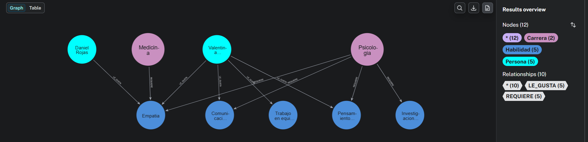
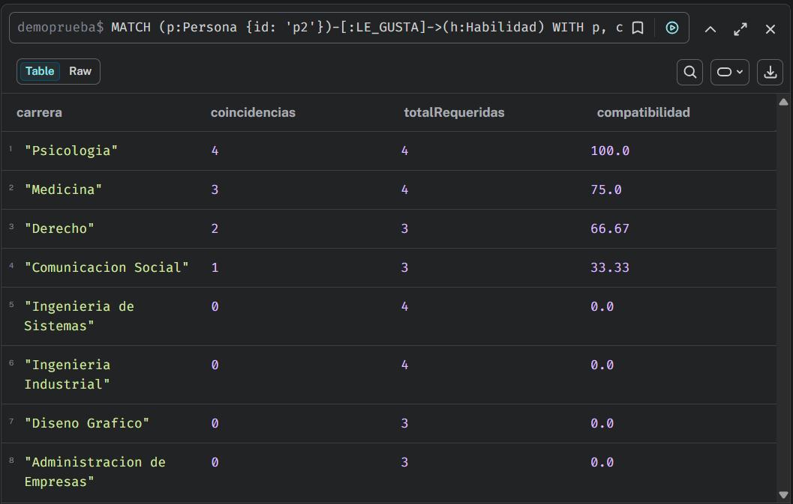

# CareerGraph 

Sistema de recomendación de carreras basado en grafos, construido con **Neo4j** y **Python**. A partir de los intereses y habilidades de una persona, calcula un porcentaje de compatibilidad con distintas carreras universitarias.

Proyecto desarrollado para la clase de base de datos no relacionales — 27/08/2026.

---

##  Autores

<table>
  <tr>
    <td align="center">
      <a href="https://github.com/JsMartinez-dev">
        
        <br />
        <b>Juan Sebastian Martinez Uribe</b>
      </a>
      <br />
      Modelado de datos, queries Cypher y conexión a base de datos
    </td>
    <td align="center">
      <a href="https://github.com/ginozza">
        
        <br />
        <b>Juan Manuel Simancas Martinez</b>
      </a>
      <br />
      Frontend con React+Vite 
    </td>
  </tr>
</table>


---

##  Descripción del problema

Elegir una carrera universitaria es una decisión difícil cuando no se tiene claridad sobre qué opciones se alinean con los intereses y habilidades propias. **CareerGraph** resuelve esto modelando personas, carreras y habilidades como un grafo, permitiendo calcular qué tan compatible es una persona con cada carrera disponible según las conexiones que comparten.

---

##  Modelo de datos

**Nodos:**
- `Persona` — usuario del sistema
- `Carrera` — carrera universitaria disponible
- `Habilidad` — habilidad o interés específico

**Relaciones:**
- `(Persona)-[:LE_GUSTA]->(Habilidad)`
- `(Carrera)-[:REQUIERE]->(Habilidad)`

**Cálculo de compatibilidad:**


Se utiliza la siguiente fórmula:

$$
Compatibilidad =
\frac{\text{Habilidades coincidentes}}
{\text{Total de habilidades requeridas}}
\times 100
$$

Donde:

- Habilidades coincidentes: habilidades que la persona tiene en común con las requeridas por la carrera.
- Total de habilidades requeridas: cantidad total de habilidades que requiere la carrera.
- Compatibilidad: porcentaje de coincidencia entre la persona y la carrera.
---

##  Tecnologías

- [Neo4j](https://neo4j.com/) (AuraDB) — base de datos de grafos
- [Python 3.x](https://www.python.org/)
- [FastAPI](https://fastapi.tiangolo.com/) — API backend
- [React 18 + TypeScript](https://react.dev/) — Frontend SPA
- [Vite](https://vite.dev/) — Build tool
- [neo4j Python Driver](https://neo4j.com/docs/python-manual/current/)
- [Pydantic](https://docs.pydantic.dev/) — validación de datos

---

## Estructura del proyecto

```
careergraph/
├── README.md
├── requirements.txt
├── .env.example
├── .gitignore
├── cypher/
│   └── queries.cypher           # Queries de consulta y recomendación
├── database/
│   ├── conexion.py              # Conexión al driver de Neo4j (legacy)
│   └── crud.py                  # Funciones de insert / update / query (legacy)
├── backend/                     # FastAPI Backend
│   ├── __init__.py
│   ├── main.py                  # Aplicación FastAPI
│   ├── config.py                # Configuración y settings
│   ├── database.py              # Conexión a Neo4j
│   ├── models.py                # Modelos Pydantic
│   └── crud.py                  # Operaciones CRUD
├── frontend-react/              # React + TypeScript + Vite Frontend
│   ├── src/
│   │   ├── App.tsx              # Componente principal
│   │   ├── api.ts               # Cliente API (axios)
│   │   ├── types.ts             # Tipos TypeScript
│   │   └── App.css              # Estilos
│   ├── package.json
│   ├── tsconfig.json
│   └── vite.config.ts
└── data/
    └── carga_inicial.py         # Script de carga de datos de ejemplo
```

---

##  Instalación y ejecución

### Prerrequisitos
- Python 3.10+
- Node.js 18+
- Neo4j 5.x (local o AuraDB)

### 1. Clonar el repositorio
```bash
git clone https://github.com/[usuario]/careergraph.git
cd careergraph
```

### 2. Configurar variables de entorno
```bash
cp .env.example .env
# Editar .env con tus credenciales Neo4j
```

### 3. Backend (FastAPI)

**Opción A: Con uv (recomendado)**
```bash
uv venv
uv pip install -r requirements.txt
uv run python data/carga_inicial.py
uv run uvicorn backend.main:app --host 0.0.0.0 --port 8000
```

**Opción B: Con venv estándar**
```bash
python -m venv .venv
.venv\Scripts\activate   # Windows
# source .venv/bin/activate  # Linux/Mac
pip install -r requirements.txt
python data/carga_inicial.py
uvicorn backend.main:app --host 0.0.0.0 --port 8000
```

Backend corriendo en: **http://localhost:8000**  
Documentación API (Swagger): **http://localhost:8000/docs**

### 4. Frontend (React + Vite)

En otra terminal:
```bash
cd frontend-react
npm install
npm run dev -- --host
```

Frontend corriendo en: **http://localhost:5173**

---

##  API Endpoints

| Método | Endpoint | Descripción |
|--------|----------|-------------|
| GET | `/` | Información de la API |
| GET | `/health` | Health check (verifica BD) |
| GET | `/stats` | Estadísticas de la BD |
| GET | `/personas` | Listar personas |
| GET | `/personas/{id}` | Obtener persona |
| POST | `/personas` | Crear persona |
| PUT | `/personas/{id}` | Actualizar persona |
| DELETE | `/personas/{id}` | Eliminar persona |
| GET | `/carreras` | Listar carreras |
| GET | `/carreras/{id}` | Obtener carrera |
| POST | `/carreras` | Crear carrera |
| GET | `/habilidades` | Listar habilidades |
| GET | `/habilidades/{id}` | Obtener habilidad |
| POST | `/habilidades` | Crear habilidad |
| GET | `/compatibilidad/{persona_id}` | Calcular compatibilidad |

---

##  Funcionalidades

- [x] Modelado de personas, carreras y habilidades como grafo
- [x] Inserción y actualización de datos vía Python (CRUD)
- [x] Consulta de compatibilidad persona–carrera
- [x] API REST completa con FastAPI
- [x] Frontend SPA moderno con React + TypeScript
- [x] Administración de personas, carreras y habilidades desde la UI
- [x] Cálculo de compatibilidad en tiempo real

---

##  Demo




---

##  Licencia

MIT
